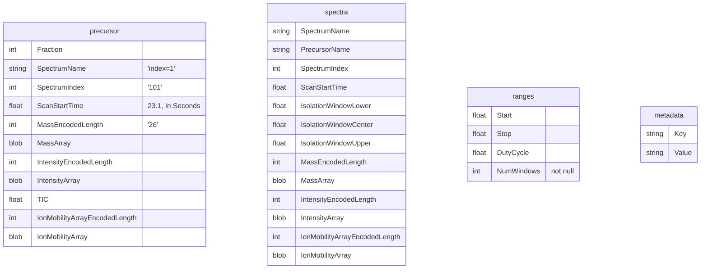

# MSflattener

It flattens ms ...

# Current state

Right now the project is in a very early stage!
Feel free to let me know if you see utility in it and request features.

## Scope

The idea of this project is to provide a way to convert and export
timsTOF and mzML data to parquet. The output format is not meant to
contain all of the data in the original file, but to provide an
intermediate representation that is fast to read by other tools.

This approach is burrowed from the genomics world, where it is common
to have intermediate representatinos of your data that do not have all
information from the progenitor data (trimmed fastq files for example);
but instead focus on just being usable for the next tool in your analysis
pipeline.

## Rationale

timsTOF data is internally organized in a peak-wise fashion with
indexing that points to the conditions in which such peak was acquired.
I would like to have a representation where contiguous peaks that share
acquisition are stored together.

In contrast, an mzML file is organized in a scan-wise fashion, where
each scan contains a list of peaks. But suffers from the fact that it
needs to support every possible acquisition mode and thus has a lot of
redundant information in each scan.

Therefore this format attempts to provide a fast and easy to read format
that will work for most of the modern experimental workflows (DIA, DDA, PRM)

In addition a lot of the project I have seen that make similar
"decompressions" of the data, do so in a way that optimizes for random
access ("I want all peaks in x-y intensity range, in x-y mass range,
in x-y ims range, in this retention time"); and whilst this is useful,
it can make reading the data slower if you want to access it in a more
sequential fashion (making XICs of A LOT of species at once).

On top of the formerly mentioned benefits, this project makes use
of apache arrow and the parquet data format pretty extensively. These
specifications and formats are widely accepted in a broad range
of applications, therefore have been very heavily optimized and give
us many benefits out of the box (readability in any programming language,
compression, strict schema within columns, speed of read/write).

## Assumptions

The file format is meant to sacrifice some of the flexibility of the
mass spectrometer in exchange for speed. In particular it assumes that
the retention time will be monotonically increasing and that all scans
that have enabled quad isolation are being fragmented with the same
collision energy.

It also assumes there will only be ms1 and ms2 scans.

## TODO
- Add sliding window neighborhood in RT.
    - This means that neighbors are counted but not integrated from neighboring scans.
- Add parallel compute.

## Additional Utility

# Installation

```
pipx install git+https://github.com/talusbio/msflattener.git
```

# Usage

The idea is to make the project usable via docker or directly as a
python package/cli.

```shell
$ msflattener bruker --to_mzml --file somefile.d --output collapsed.mzML
$ msflattener bruker --to_parquet --file somefile.d --output collapsed.parquet
$ msflattener mzml --file myfile2.mzML --output collapsed2.parquet
```

```python
import polars as pl
pl.scan_parquet("testfile.pq").head().collect()
# shape: (5, 6)
# ┌─────────────────────────────┬─────────────────────────────┬────────────────────────┬───────────┬────────────────────┬─────────────────────┐
# │ mz_values                   ┆ corrected_intensity_values  ┆ mobility_values        ┆ rt_values ┆ quad_low_mz_values ┆ quad_high_mz_values │
# │ ---                         ┆ ---                         ┆ ---                    ┆ ---       ┆ ---                ┆ ---                 │
# │ list[f64]                   ┆ list[f32]                   ┆ list[f64]              ┆ f32       ┆ f32                ┆ f32                 │
# ╞═════════════════════════════╪═════════════════════════════╪════════════════════════╪═══════════╪════════════════════╪═════════════════════╡
# │ [343.77005, 443.744765, …   ┆ [212.0, 222.0, … 9.0]       ┆ [0.89807, 0.93816, …   ┆ 0.4161    ┆ 600.0              ┆ 625.0               │
# │ 571.71…                     ┆                             ┆ 0.88162]               ┆           ┆                    ┆                     │
# │ [261.800201, 333.735199, …  ┆ [215.0, 209.0, … 9.0]       ┆ [0.764408, 0.736648, … ┆ 0.4161    ┆ 400.0              ┆ 425.0               │
# │ 602.6…                      ┆                             ┆ 0.781887]              ┆           ┆                    ┆                     │
# │ [565.678162, 290.368408, …  ┆ [91.0, 83.0, … 9.0]         ┆ [0.642056, 0.642056, … ┆ 0.4161    ┆ -1.0               ┆ -1.0                │
# │ 708.6…                      ┆                             ┆ 0.642056]              ┆           ┆                    ┆                     │
# │ [586.693481, 640.599675, …  ┆ [223.0, 290.0, … 9.0]       ┆ [1.068746, 1.005195, … ┆ 0.4161    ┆ 800.0              ┆ 825.0               │
# │ 1010.…                      ┆                             ┆ 1.335042]              ┆           ┆                    ┆                     │
# │ [629.720764, 375.776306, …  ┆ [201.0, 183.0, … 9.0]       ┆ [1.05538, 1.085197, …  ┆ 0.496965  ┆ 825.0              ┆ 850.0               │
# │ 1456.…                      ┆                             ┆ 1.304197]              ┆           ┆                    ┆                     │
# └─────────────────────────────┴─────────────────────────────┴────────────────────────┴───────────┴────────────────────┴─────────────────────┘
```

## Exporting to mzML

The mzML will not be compliant with the standard but should be good enough to be searched with a search engine.
If it does not, feel free to write an issue so we can figure out trogether why that is the case.

```python
from msflattener.mzml import write_mzml
write_mzml(two_d_merge, "foo.mzml")
```

## Exporting to .dia

https://bitbucket.org/searleb/encyclopedia/downloads/

NOTE: This schema is not up to date, I am looking for a way to generate it programatically.



## Acknowledgements

Open source projects that I would like to acknowledge:
- Alphatims
- PSIMS
- scipy
- polars
- numpy
