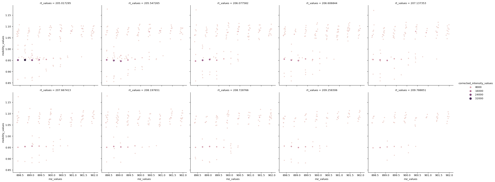

# Time transformation times

``` python
from msflattener.bruker import centroid_ims, get_timstof_data, merge_ims_simple, centroid_ims_slidingwindow, merge_ims_twostep
import matplotlib.pyplot as plt
import polars as pl
import numpy as np
import seaborn as sns

# Data from the alphatims paper from the mann lab
out = get_timstof_data("/Users/sebastianpaez/git/msflattener/data/20210510_TIMS03_EVO03_PaSk_MA_HeLa_50ng_5_6min_DDA_S1-B1_1_25185.d", progbar=False, safe=False)
# Subsetting to only 10 secs
out = out.filter(pl.col("rt_values").is_between(200, 210))
print(out)
```

      0%|          | 0/3156 [00:00<?, ?it/s] 28%|██▊       | 898/3156 [00:00<00:00, 8978.49it/s] 57%|█████▋    | 1796/3156 [00:00<00:00, 5210.24it/s] 76%|███████▌  | 2403/3156 [00:00<00:00, 3902.64it/s] 91%|█████████ | 2857/3156 [00:00<00:00, 3550.69it/s]100%|██████████| 3156/3156 [00:00<00:00, 3876.02it/s]

    shape: (19_074, 6)
    ┌─────────────────┬────────────────┬────────────┬────────────────┬────────────────┬────────────────┐
    │ mz_values       ┆ corrected_inte ┆ rt_values  ┆ mobility_value ┆ quad_low_mz_va ┆ quad_high_mz_v │
    │ ---             ┆ nsity_values   ┆ ---        ┆ s              ┆ lues           ┆ alues          │
    │ list[f64]       ┆ ---            ┆ f64        ┆ ---            ┆ ---            ┆ ---            │
    │                 ┆ list[u32]      ┆            ┆ f64            ┆ f64            ┆ f64            │
    ╞═════════════════╪════════════════╪════════════╪════════════════╪════════════════╪════════════════╡
    │ [294.172484,    ┆ [62, 142, …    ┆ 200.033998 ┆ 1.025647       ┆ 759.568027     ┆ 762.176751     │
    │ 312.182316, …   ┆ 87]            ┆            ┆                ┆                ┆                │
    │ 1095.…          ┆                ┆            ┆                ┆                ┆                │
    │ [252.511594,    ┆ [10, 229, …    ┆ 200.033998 ┆ 0.97069        ┆ 897.42133      ┆ 900.42133      │
    │ 652.267875, …   ┆ 67]            ┆            ┆                ┆                ┆                │
    │ 1047.…          ┆                ┆            ┆                ┆                ┆                │
    │ [525.265058,    ┆ [159, 147, …   ┆ 200.033998 ┆ 0.969612       ┆ 897.42133      ┆ 900.42133      │
    │ 614.460664, …   ┆ 168]           ┆            ┆                ┆                ┆                │
    │ 1047.…          ┆                ┆            ┆                ┆                ┆                │
    │ [360.217462,    ┆ [228, 187, …   ┆ 200.033998 ┆ 0.968534       ┆ 897.42133      ┆ 900.42133      │
    │ 603.746977, …   ┆ 91]            ┆            ┆                ┆                ┆                │
    │ 1047.…          ┆                ┆            ┆                ┆                ┆                │
    │ …               ┆ …              ┆ …          ┆ …              ┆ …              ┆ …              │
    │ [366.194518,    ┆ [176, 166, …   ┆ 209.999941 ┆ 0.840302       ┆ 521.101053     ┆ 523.101053     │
    │ 400.674401, …   ┆ 108]           ┆            ┆                ┆                ┆                │
    │ 943.5…          ┆                ┆            ┆                ┆                ┆                │
    │ [306.15006,     ┆ [63, 120, …    ┆ 209.999941 ┆ 0.839224       ┆ 521.101053     ┆ 523.101053     │
    │ 367.131264, …   ┆ 76]            ┆            ┆                ┆                ┆                │
    │ 863.38…         ┆                ┆            ┆                ┆                ┆                │
    │ [271.982924,    ┆ [63, 47, … 99] ┆ 209.999941 ┆ 0.835991       ┆ 521.101053     ┆ 523.101053     │
    │ 272.003812, …   ┆                ┆            ┆                ┆                ┆                │
    │ 943.5…          ┆                ┆            ┆                ┆                ┆                │
    │ [408.22019,     ┆ [227, 42, …    ┆ 209.999941 ┆ 0.834914       ┆ 521.101053     ┆ 523.101053     │
    │ 471.828781, …   ┆ 24]            ┆            ┆                ┆                ┆                │
    │ 862.36…         ┆                ┆            ┆                ┆                ┆                │
    └─────────────────┴────────────────┴────────────┴────────────────┴────────────────┴────────────────┘

``` python
MZ_LIMS=(898, 902)
IMS_LIMS = (0.80, 1.20)
RT_LIMS = (200, 210)
QUAD_LOW_VAL=-1

def filter_and_melt(df):
    promise = (
        pl.col("rt_values")
        .is_between(*RT_LIMS) & 
        pl.col("quad_low_mz_values")
        .is_between(QUAD_LOW_VAL-0.01, QUAD_LOW_VAL+0.011)
    )
    unnest_cols = ['mz_values', 'corrected_intensity_values']
    if "mobility_values" in df.columns and hasattr(df["mobility_values"][0], "__len__"):
        unnest_cols.append("mobility_values")
    out = df.filter(promise).explode(unnest_cols).filter(pl.col("mz_values").is_between(*MZ_LIMS)).filter(pl.col("rt_values").is_between(205, 210))

    if "mobility_values" in out.columns:
        out = out.filter(pl.col("mobility_values").is_between(*IMS_LIMS))

    return out

sns.relplot(data=filter_and_melt(out).to_pandas(), x= "mz_values", y ="mobility_values", col="rt_values", size="corrected_intensity_values", hue="corrected_intensity_values", col_wrap=5)
```


``` python
%%time
simple_merge = merge_ims_simple(out, min_neighbors=3, mz_distance=0.01, progbar=False)
```

    2023-05-07 18:21:01.895 | INFO     | msflattener.bruker:merge_ims_simple:120 - Finished simple ims merge, skipped 140/401 spectra for not having any peaks

    CPU times: user 1min 10s, sys: 2.37 s, total: 1min 13s
    Wall time: 1min 13s

``` python
%%time
centroid_merge = centroid_ims(out, min_neighbors=3, mz_distance=0.01, ims_distance=0.01, progbar=False)
```

    2023-05-07 18:21:19.225 | INFO     | msflattener.bruker:centroid_ims:184 - Finished simple ims merge, skipped 144/401 spectra for not having any peaks

    CPU times: user 17 s, sys: 319 ms, total: 17.4 s
    Wall time: 17.3 s

``` python
sns.relplot(data=filter_and_melt(centroid_merge).to_pandas(), x= "mz_values", y ="mobility_values", col="rt_values", size="corrected_intensity_values", hue="corrected_intensity_values", col_wrap=5)
```


``` python
%%time
slidewindow = centroid_ims_slidingwindow(out, min_neighbors=10, mz_distance=0.01, ims_distance=0.01, rt_distance=2, progbar=False)
```

    2023-05-07 18:24:27.417 | INFO     | msflattener.bruker:centroid_ims_slidingwindow:260 - Finished Sliding, skipped 294/401 spectra for not having any peaks

    CPU times: user 48.6 s, sys: 1.83 s, total: 50.5 s
    Wall time: 3min 6s

``` python
sns.relplot(data=filter_and_melt(slidewindow).to_pandas(), x= "mz_values", y ="mobility_values", col="rt_values", size="corrected_intensity_values", hue="corrected_intensity_values", col_wrap=5)
```



``` python
%%time
twostep = merge_ims_twostep(out, min_neighbors=3, mz_distance=0.01, ims_distance=0.01, progbar=False)
```

    2023-05-07 18:24:47.318 | INFO     | msflattener.bruker:merge_ims_twostep:336 - Finished simple ims merge, skipped 144/401 spectra for not having any peaks

    CPU times: user 18.1 s, sys: 516 ms, total: 18.7 s
    Wall time: 18.6 s

``` python
g = sns.FacetGrid(filter_and_melt(slidewindow).to_pandas(), col_wrap=5, col="rt_values")
g.map_dataframe(sns.scatterplot, x="mz_values", y="mobility_values", hue="corrected_intensity_values", size="corrected_intensity_values")
```


