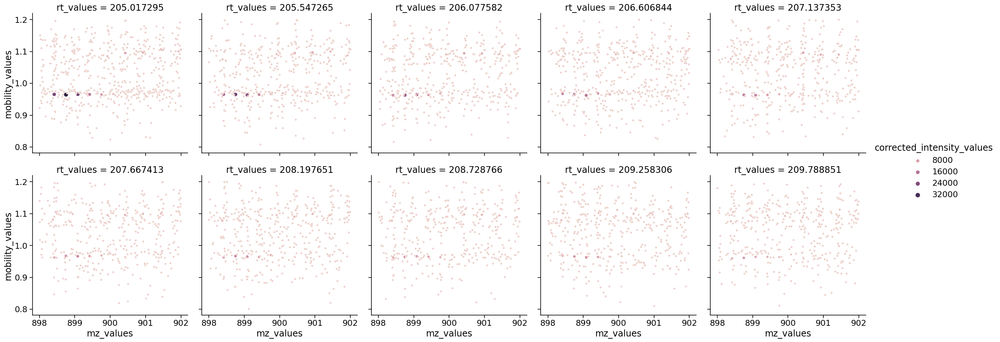

# Time transformation times

``` python
from msflattener.bruker import centroid_ims, get_timstof_data, merge_ims_simple
import matplotlib.pyplot as plt
import polars as pl
import numpy as np
import seaborn as sns

# Data from the alphatims paper from the mann lab
out = get_timstof_data("data/20210510_TIMS03_EVO03_PaSk_MA_HeLa_50ng_5_6min_DDA_S1-B1_1_25185.d", progbar=False, safe=False, centroid=False)
# Subsetting to only 10 secs
out = out.filter(pl.col("rt_values").is_between(200, 210))

# (out
#     .filter(pl.col("quad_low_mz_values") < 0)
#     .explode(['mz_values', 'corrected_intensity_values'])
#     .filter(pl.col('mz_values')
#     .is_between(898, 902))
#     .groupby(
#         ['rt_values','mobility_values',
#          'quad_low_mz_values','quad_high_mz_values'])
#     .agg(pl.col(['mz_values', 'corrected_intensity_values']))
#     .write_parquet("samplefile.pq")
# )

print(out)
```

    shape: (696, 9)
    ┌─────────┬────────────┬────────────┬─────────┬───┬────────────┬────────────┬────────────┬────────────┐
    │ mz_valu ┆ corrected_ ┆ mobility_v ┆ rt_valu ┆ … ┆ quad_high_ ┆ precursor_ ┆ precursor_ ┆ precursor_ │
    │ es      ┆ intensity_ ┆ alues      ┆ es      ┆   ┆ mz_values  ┆ mz_values  ┆ charge     ┆ intensity  │
    │ ---     ┆ values     ┆ ---        ┆ ---     ┆   ┆ ---        ┆ ---        ┆ ---        ┆ ---        │
    │ list[f6 ┆ ---        ┆ list[f64]  ┆ f64     ┆   ┆ f64        ┆ f64        ┆ f64        ┆ f64        │
    │ 4]      ┆ list[f64]  ┆            ┆         ┆   ┆            ┆            ┆            ┆            │
    ╞═════════╪════════════╪════════════╪═════════╪═══╪════════════╪════════════╪════════════╪════════════╡
    │ [530.29 ┆ [124.0,    ┆ [1.191799, ┆ 200.033 ┆ … ┆ 1057.65747 ┆ 1055.51374 ┆ 2.0        ┆ 4394.0     │
    │ 6806,   ┆ 157.0, …   ┆ 1.191799,  ┆ 998     ┆   ┆ 9          ┆ 9          ┆            ┆            │
    │ 583.276 ┆ 44.0]      ┆ …          ┆         ┆   ┆            ┆            ┆            ┆            │
    │ 538, …  ┆            ┆ 1.191799]  ┆         ┆   ┆            ┆            ┆            ┆            │
    │ 1509.…  ┆            ┆            ┆         ┆   ┆            ┆            ┆            ┆            │
    │ [260.19 ┆ [88.0,     ┆ [1.140245, ┆ 200.033 ┆ … ┆ 920.98967  ┆ 918.968896 ┆ 2.0        ┆ 11495.0    │
    │ 5043,   ┆ 29.0, …    ┆ 1.140245,  ┆ 998     ┆   ┆            ┆            ┆            ┆            │
    │ 260.218 ┆ 124.0]     ┆ …          ┆         ┆   ┆            ┆            ┆            ┆            │
    │ 028, …  ┆            ┆ 1.113355]  ┆         ┆   ┆            ┆            ┆            ┆            │
    │ 1478.…  ┆            ┆            ┆         ┆   ┆            ┆            ┆            ┆            │
    │ [460.14 ┆ [138.0,    ┆ [1.086469, ┆ 200.033 ┆ … ┆ 871.919085 ┆ 869.919398 ┆ 2.0        ┆ 3935.0     │
    │ 9463,   ┆ 129.0, …   ┆ 1.086469,  ┆ 998     ┆   ┆            ┆            ┆            ┆            │
    │ 617.302 ┆ 89.0]      ┆ …          ┆         ┆   ┆            ┆            ┆            ┆            │
    │ 712, …  ┆            ┆ 1.068547]  ┆         ┆   ┆            ┆            ┆            ┆            │
    │ 1266.…  ┆            ┆            ┆         ┆   ┆            ┆            ┆            ┆            │
    │ [430.93 ┆ [10.0,     ┆ [1.042789, ┆ 200.033 ┆ … ┆ 762.176751 ┆ 760.416011 ┆ 2.0        ┆ 10193.0    │
    │ 9737,   ┆ 30.0, …    ┆ 1.042789,  ┆ 998     ┆   ┆            ┆            ┆            ┆            │
    │ 434.744 ┆ 276.0]     ┆ …          ┆         ┆   ┆            ┆            ┆            ┆            │
    │ 041, …  ┆            ┆ 1.024873]  ┆         ┆   ┆            ┆            ┆            ┆            │
    │ 862.9…  ┆            ┆            ┆         ┆   ┆            ┆            ┆            ┆            │
    │ …       ┆ …          ┆ …          ┆ …       ┆ … ┆ …          ┆ …          ┆ …          ┆ …          │
    │ [346.51 ┆ [21.0,     ┆ [0.925255, ┆ 209.999 ┆ … ┆ 604.636681 ┆ 603.326573 ┆ 2.0        ┆ 10795.0    │
    │ 1812,   ┆ 128.0, …   ┆ 0.925255,  ┆ 941     ┆   ┆            ┆            ┆            ┆            │
    │ 424.215 ┆ 74.0]      ┆ …          ┆         ┆   ┆            ┆            ┆            ┆            │
    │ 635, …  ┆            ┆ 0.898403]  ┆         ┆   ┆            ┆            ┆            ┆            │
    │ 979.4…  ┆            ┆            ┆         ┆   ┆            ┆            ┆            ┆            │
    │ [285.15 ┆ [117.0,    ┆ [0.867081, ┆ 209.999 ┆ … ┆ 523.101053 ┆ 521.831238 ┆ 2.0        ┆ 12927.0    │
    │ 7875,   ┆ 102.0, …   ┆ 0.867081,  ┆ 941     ┆   ┆            ┆            ┆            ┆            │
    │ 340.163 ┆ 84.0]      ┆ …          ┆         ┆   ┆            ┆            ┆            ┆            │
    │ 692, …  ┆            ┆ 0.840239]  ┆         ┆   ┆            ┆            ┆            ┆            │
    │ 928.5…  ┆            ┆            ┆         ┆   ┆            ┆            ┆            ┆            │
    │ [299.11 ┆ [91.0,     ┆ [0.782099, ┆ 209.999 ┆ … ┆ 411.428062 ┆ 410.240857 ┆ 1.0        ┆ 11439.0    │
    │ 4387,   ┆ 91.0, …    ┆ 0.782099,  ┆ 941     ┆   ┆            ┆            ┆            ┆            │
    │ 486.272 ┆ 131.0]     ┆ …          ┆         ┆   ┆            ┆            ┆            ┆            │
    │ 76, …   ┆            ┆ 0.755272]  ┆         ┆   ┆            ┆            ┆            ┆            │
    │ 702.16… ┆            ┆            ┆         ┆   ┆            ┆            ┆            ┆            │
    │ [382.13 ┆ [129.0,    ┆ [0.727333, ┆ 209.999 ┆ … ┆ 382.335078 ┆ 381.191914 ┆ 2.0        ┆ 5855.0     │
    │ 8052,   ┆ 211.0, …   ┆ 0.727333,  ┆ 941     ┆   ┆            ┆            ┆            ┆            │
    │ 387.202 ┆ 101.0]     ┆ …          ┆         ┆   ┆            ┆            ┆            ┆            │
    │ 434, …  ┆            ┆ 0.727333]  ┆         ┆   ┆            ┆            ┆            ┆            │
    │ 647.3…  ┆            ┆            ┆         ┆   ┆            ┆            ┆            ┆            │
    └─────────┴────────────┴────────────┴─────────┴───┴────────────┴────────────┴────────────┴────────────┘

``` python
MZ_LIMS=(898, 902)
# MZ_LIMS=(899.6, 900.0)
IMS_LIMS = (0.80, 1.20)
RT_LIMS = (200, 210)
QUAD_LOW_VAL=-1

def filter_and_melt(df):
    promise = (
        pl.col("rt_values")
        .is_between(*RT_LIMS) &
        pl.col("quad_low_mz_values")
        .is_between(QUAD_LOW_VAL-0.01, QUAD_LOW_VAL+0.011)
    )
    unnest_cols = ['mz_values', 'corrected_intensity_values']
    if "mobility_values" in df.columns and hasattr(df["mobility_values"][0], "__len__"):
        unnest_cols.append("mobility_values")
    out = (
        df
        .filter(promise)
        .explode(unnest_cols)
        .filter(
            pl.col("mz_values").is_between(*MZ_LIMS)
        )
        .filter(pl.col("rt_values")
        .is_between(205, 210))
    )

    if "mobility_values" in out.columns:
        out = out.filter(pl.col('mobility_values').is_between(*IMS_LIMS))

    return out

sns.set_context("notebook", font_scale=1.5, rc={"lines.linewidth": 0.02})
sns.relplot(data=filter_and_melt(out).to_pandas(), x= "mz_values", y ="mobility_values", col="rt_values", size="corrected_intensity_values", hue="corrected_intensity_values", col_wrap=5)
```


``` python
%%time
simple_merge = merge_ims_simple(out, min_neighbors=3, mz_distance=0.01, progbar=False)
```

    2023-05-15 16:04:36.474 | INFO     | msflattener.bruker:merge_ims_simple:371 - Finished simple ims merge, skipped 163/696 spectra for not having any peaks

    CPU times: user 1min 12s, sys: 2.33 s, total: 1min 14s
    Wall time: 1min 14s

``` python
%%time
centroid_merge = centroid_ims(out, min_neighbors=1, mz_distance=0.01, ims_distance=0.02, progbar=False)
```

    2023-05-15 16:05:17.299 | INFO     | msflattener.bruker:centroid_ims:421 - Finished simple ims merge, skipped 0/696 spectra for not having any peaks

    CPU times: user 40.2 s, sys: 710 ms, total: 40.9 s
    Wall time: 40.8 s

``` python
sns.set_context("notebook", font_scale=1.5, rc={"lines.linewidth": 0.02})
sns.relplot(data=filter_and_melt(centroid_merge).to_pandas(), x= "mz_values", y ="mobility_values", col="rt_values", size="corrected_intensity_values", hue="corrected_intensity_values", col_wrap=5)
```


