# Visualizing centroiding

``` python
from msflattener.bruker import centroid_ims, get_timstof_data
import matplotlib.pyplot as plt
import polars as pl
import numpy as np

# Data from the alphatims paper from the mann lab
out = get_timstof_data("/Users/sebastianpaez/git/msflattener/data/20210510_TIMS03_EVO03_PaSk_MA_HeLa_50ng_5_6min_DDA_S1-B1_1_25185.d", progbar=False, safe=False)
print(out)
```

    WARNING:root:WARNING: Temp mmap arrays are written to /var/folders/42/tyvw22cj7t35kbjs0frhf_vw0000gp/T/temp_mmap_lsiodd_h. Cleanup of this folder is OS dependant, and might need to be triggered manually! Current space: 458,793,803,776
    WARNING:root:WARNING: No Bruker libraries are available for this operating system. Mobility and m/z values need to be estimated. While this estimation often returns acceptable results with errors < 0.02 Th, huge errors (e.g. offsets of 6 Th) have already been observed for some samples!
    /Users/sebastianpaez/git/msflattener/venv/lib/python3.10/site-packages/tqdm/auto.py:21: TqdmWarning: IProgress not found. Please update jupyter and ipywidgets. See https://ipywidgets.readthedocs.io/en/stable/user_install.html
      from .autonotebook import tqdm as notebook_tqdm
      0%|          | 0/3156 [00:00<?, ?it/s]  0%|          | 1/3156 [00:00<19:01,  2.76it/s] 24%|██▍       | 767/3156 [00:00<00:01, 2170.37it/s] 41%|████      | 1287/3156 [00:00<00:00, 3031.54it/s] 56%|█████▌    | 1767/3156 [00:00<00:00, 3130.76it/s] 69%|██████▉   | 2188/3156 [00:00<00:00, 3273.87it/s] 82%|████████▏ | 2587/3156 [00:00<00:00, 3192.93it/s] 94%|█████████▎| 2954/3156 [00:01<00:00, 3069.69it/s]100%|██████████| 3156/3156 [00:01<00:00, 2720.12it/s]

    shape: (610_480, 6)
    ┌─────────────────┬────────────────┬────────────┬────────────────┬────────────────┬────────────────┐
    │ mz_values       ┆ corrected_inte ┆ rt_values  ┆ mobility_value ┆ quad_low_mz_va ┆ quad_high_mz_v │
    │ ---             ┆ nsity_values   ┆ ---        ┆ s              ┆ lues           ┆ alues          │
    │ list[f64]       ┆ ---            ┆ f64        ┆ ---            ┆ ---            ┆ ---            │
    │                 ┆ list[u32]      ┆            ┆ f64            ┆ f64            ┆ f64            │
    ╞═════════════════╪════════════════╪════════════╪════════════════╪════════════════╪════════════════╡
    │ [939.546112,    ┆ [101, 141, …   ┆ 0.546519   ┆ 1.523491       ┆ -1.0           ┆ -1.0           │
    │ 949.774306, …   ┆ 42]            ┆            ┆                ┆                ┆                │
    │ 1187.…          ┆                ┆            ┆                ┆                ┆                │
    │ [594.358123,    ┆ [156, 128, …   ┆ 0.546519   ┆ 1.517026       ┆ -1.0           ┆ -1.0           │
    │ 947.433779, …   ┆ 74]            ┆            ┆                ┆                ┆                │
    │ 1161.…          ┆                ┆            ┆                ┆                ┆                │
    │ [773.332937,    ┆ [89, 145, …    ┆ 0.546519   ┆ 1.515948       ┆ -1.0           ┆ -1.0           │
    │ 865.079211, …   ┆ 103]           ┆            ┆                ┆                ┆                │
    │ 1278.…          ┆                ┆            ┆                ┆                ┆                │
    │ [951.663459,    ┆ [85, 23, … 41] ┆ 0.546519   ┆ 1.514871       ┆ -1.0           ┆ -1.0           │
    │ 994.54328, …    ┆                ┆            ┆                ┆                ┆                │
    │ 1570.5…         ┆                ┆            ┆                ┆                ┆                │
    │ …               ┆ …              ┆ …          ┆ …              ┆ …              ┆ …              │
    │ [214.108916,    ┆ [108, 52, …    ┆ 337.581518 ┆ 0.676509       ┆ -1.0           ┆ -1.0           │
    │ 214.920486, …   ┆ 51]            ┆            ┆                ┆                ┆                │
    │ 488.2…          ┆                ┆            ┆                ┆                ┆                │
    │ [215.08995,     ┆ [238, 107, …   ┆ 337.581518 ┆ 0.675431       ┆ -1.0           ┆ -1.0           │
    │ 215.138713, …   ┆ 241]           ┆            ┆                ┆                ┆                │
    │ 409.44…         ┆                ┆            ┆                ┆                ┆                │
    │ [121.498912,    ┆ [182, 169, …   ┆ 337.581518 ┆ 0.668966       ┆ -1.0           ┆ -1.0           │
    │ 200.074312, …   ┆ 208]           ┆            ┆                ┆                ┆                │
    │ 475.2…          ┆                ┆            ┆                ┆                ┆                │
    │ [196.862614,    ┆ [10, 221, …    ┆ 337.581518 ┆ 0.659267       ┆ -1.0           ┆ -1.0           │
    │ 200.874566, …   ┆ 249]           ┆            ┆                ┆                ┆                │
    │ 543.6…          ┆                ┆            ┆                ┆                ┆                │
    └─────────────────┴────────────────┴────────────┴────────────────┴────────────────┴────────────────┘

``` python
centroided_out = centroid_ims(out, min_neighbors=2, mz_distance=0.02, ims_distance=0.02, progbar=False)
print(centroided_out)
```

    2023-05-07 18:40:14.932 | INFO     | msflattener.bruker:centroid_ims:184 - Finished simple ims merge, skipped 1181/7227 spectra for not having any peaks

    shape: (6_046, 6)
    ┌─────────────────┬────────────────┬────────────────┬────────────────┬────────────────┬────────────┐
    │ mz_values       ┆ corrected_inte ┆ mobility_value ┆ quad_low_mz_va ┆ quad_high_mz_v ┆ rt_values  │
    │ ---             ┆ nsity_values   ┆ s              ┆ lues           ┆ alues          ┆ ---        │
    │ list[f64]       ┆ ---            ┆ ---            ┆ ---            ┆ ---            ┆ f64        │
    │                 ┆ list[u64]      ┆ list[f64]      ┆ f64            ┆ f64            ┆            │
    ╞═════════════════╪════════════════╪════════════════╪════════════════╪════════════════╪════════════╡
    │ [527.923905,    ┆ [1733, 7251, … ┆ [0.953394,     ┆ -1.0           ┆ -1.0           ┆ 0.546519   │
    │ 523.089803, …   ┆ 508]           ┆ 1.0229, …      ┆                ┆                ┆            │
    │ 217.9…          ┆                ┆ 0.656213]      ┆                ┆                ┆            │
    │ [576.352127,    ┆ [20, 645, …    ┆ [1.022953,     ┆ -1.0           ┆ -1.0           ┆ 0.801668   │
    │ 297.166192, …   ┆ 610]           ┆ 0.83319, …     ┆                ┆                ┆            │
    │ 310.4…          ┆                ┆ 0.654448]      ┆                ┆                ┆            │
    │ [440.097176,    ┆ [517, 383, …   ┆ [0.88531,      ┆ -1.0           ┆ -1.0           ┆ 1.331647   │
    │ 988.700083, …   ┆ 585]           ┆ 0.788735, …    ┆                ┆                ┆            │
    │ 963.9…          ┆                ┆ 0.717028]      ┆                ┆                ┆            │
    │ [1064.993176,   ┆ [492, 907, …   ┆ [0.839697,     ┆ -1.0           ┆ -1.0           ┆ 1.861262   │
    │ 272.874773, …   ┆ 497]           ┆ 0.690627, …    ┆                ┆                ┆            │
    │ 245.…           ┆                ┆ 0.64473]       ┆                ┆                ┆            │
    │ …               ┆ …              ┆ …              ┆ …              ┆ …              ┆ …          │
    │ [577.972306,    ┆ [8525, 664, …  ┆ [0.969988,     ┆ 577.338374     ┆ 579.338374     ┆ 336.944843 │
    │ 579.060245, …   ┆ 473888]        ┆ 0.965823, …    ┆                ┆                ┆            │
    │ 578.0…          ┆                ┆ 0.970629]      ┆                ┆                ┆            │
    │ [882.326765,    ┆ [588, 12072, … ┆ [1.381234,     ┆ -1.0           ┆ -1.0           ┆ 337.051723 │
    │ 440.360251, …   ┆ 563]           ┆ 1.053169, …    ┆                ┆                ┆            │
    │ 243.1…          ┆                ┆ 0.722349]      ┆                ┆                ┆            │
    │ [598.780234,    ┆ [107, 243, …   ┆ [0.949752,     ┆ 597.308248     ┆ 599.308248     ┆ 337.475285 │
    │ 598.280235, …   ┆ 12060]         ┆ 0.94975, …     ┆                ┆                ┆            │
    │ 598.0…          ┆                ┆ 0.950012]      ┆                ┆                ┆            │
    │ [763.542499,    ┆ [9885, 37873,  ┆ [1.382727,     ┆ -1.0           ┆ -1.0           ┆ 337.581518 │
    │ 449.328997, …   ┆ … 514]         ┆ 1.051557, …    ┆                ┆                ┆            │
    │ 364.9…          ┆                ┆ 0.795831]      ┆                ┆                ┆            │
    └─────────────────┴────────────────┴────────────────┴────────────────┴────────────────┴────────────┘

``` python
MZ_LIMS=(898, 902)
IMS_LIMS = (0.80, 1.20)
RT_LIMS = (200, 210)
QUAD_LOW_VAL=-1

promise = (
    pl.col("rt_values")
    .is_between(*RT_LIMS) & 
    pl.col("quad_low_mz_values")
    .is_between(QUAD_LOW_VAL-0.01, QUAD_LOW_VAL+0.011)
)
orig = out.filter(promise)
collapsed = centroided_out.filter(promise)

print(orig)
print(collapsed)
```

    shape: (15_732, 6)
    ┌─────────────────┬────────────────┬────────────┬────────────────┬────────────────┬────────────────┐
    │ mz_values       ┆ corrected_inte ┆ rt_values  ┆ mobility_value ┆ quad_low_mz_va ┆ quad_high_mz_v │
    │ ---             ┆ nsity_values   ┆ ---        ┆ s              ┆ lues           ┆ alues          │
    │ list[f64]       ┆ ---            ┆ f64        ┆ ---            ┆ ---            ┆ ---            │
    │                 ┆ list[u32]      ┆            ┆ f64            ┆ f64            ┆ f64            │
    ╞═════════════════╪════════════════╪════════════╪════════════════╪════════════════╪════════════════╡
    │ [812.398972,    ┆ [154, 35, …    ┆ 200.24562  ┆ 1.545043       ┆ -1.0           ┆ -1.0           │
    │ 959.577199, …   ┆ 97]            ┆            ┆                ┆                ┆                │
    │ 1271.…          ┆                ┆            ┆                ┆                ┆                │
    │ [859.444759,    ┆ [80, 119, …    ┆ 200.24562  ┆ 1.543966       ┆ -1.0           ┆ -1.0           │
    │ 970.579297, …   ┆ 136]           ┆            ┆                ┆                ┆                │
    │ 1203.…          ┆                ┆            ┆                ┆                ┆                │
    │ [896.449903,    ┆ [120, 137, …   ┆ 200.24562  ┆ 1.542888       ┆ -1.0           ┆ -1.0           │
    │ 958.41035, …    ┆ 63]            ┆            ┆                ┆                ┆                │
    │ 1213.5…         ┆                ┆            ┆                ┆                ┆                │
    │ [868.46312,     ┆ [100, 101, …   ┆ 200.24562  ┆ 1.54181        ┆ -1.0           ┆ -1.0           │
    │ 957.533229, …   ┆ 42]            ┆            ┆                ┆                ┆                │
    │ 1315.5…         ┆                ┆            ┆                ┆                ┆                │
    │ …               ┆ …              ┆ …          ┆ …              ┆ …              ┆ …              │
    │ [191.236798,    ┆ [150, 143, …   ┆ 209.788851 ┆ 0.656034       ┆ -1.0           ┆ -1.0           │
    │ 208.093907, …   ┆ 159]           ┆            ┆                ┆                ┆                │
    │ 549.6…          ┆                ┆            ┆                ┆                ┆                │
    │ [201.1282,      ┆ [155, 23, …    ┆ 209.788851 ┆ 0.653879       ┆ -1.0           ┆ -1.0           │
    │ 221.100928, …   ┆ 183]           ┆            ┆                ┆                ┆                │
    │ 480.180…        ┆                ┆            ┆                ┆                ┆                │
    │ [110.061563,    ┆ [88, 204, …    ┆ 209.788851 ┆ 0.650647       ┆ -1.0           ┆ -1.0           │
    │ 203.138214, …   ┆ 104]           ┆            ┆                ┆                ┆                │
    │ 508.6…          ┆                ┆            ┆                ┆                ┆                │
    │ [201.12371,     ┆ [84, 183, …    ┆ 209.788851 ┆ 0.649569       ┆ -1.0           ┆ -1.0           │
    │ 207.090244, …   ┆ 178]           ┆            ┆                ┆                ┆                │
    │ 562.86…         ┆                ┆            ┆                ┆                ┆                │
    └─────────────────┴────────────────┴────────────┴────────────────┴────────────────┴────────────────┘
    shape: (19, 6)
    ┌─────────────────┬────────────────┬────────────────┬────────────────┬────────────────┬────────────┐
    │ mz_values       ┆ corrected_inte ┆ mobility_value ┆ quad_low_mz_va ┆ quad_high_mz_v ┆ rt_values  │
    │ ---             ┆ nsity_values   ┆ s              ┆ lues           ┆ alues          ┆ ---        │
    │ list[f64]       ┆ ---            ┆ ---            ┆ ---            ┆ ---            ┆ f64        │
    │                 ┆ list[u64]      ┆ list[f64]      ┆ f64            ┆ f64            ┆            │
    ╞═════════════════╪════════════════╪════════════════╪════════════════╪════════════════╪════════════╡
    │ [713.855846,    ┆ [12870, 9930,  ┆ [0.978813,     ┆ -1.0           ┆ -1.0           ┆ 200.24562  │
    │ 729.853205, …   ┆ … 524]         ┆ 0.989341, …    ┆                ┆                ┆            │
    │ 382.8…          ┆                ┆ 0.703681]      ┆                ┆                ┆            │
    │ [542.602374,    ┆ [969, 12684, … ┆ [0.8347,       ┆ -1.0           ┆ -1.0           ┆ 200.777502 │
    │ 507.249499, …   ┆ 501]           ┆ 0.824429, …    ┆                ┆                ┆            │
    │ 338.8…          ┆                ┆ 0.706971]      ┆                ┆                ┆            │
    │ [535.268862,    ┆ [15804, 4301,  ┆ [0.847394,     ┆ -1.0           ┆ -1.0           ┆ 201.306239 │
    │ 509.925802, …   ┆ … 505]         ┆ 0.802057, …    ┆                ┆                ┆            │
    │ 280.6…          ┆                ┆ 0.720574]      ┆                ┆                ┆            │
    │ [477.215648,    ┆ [5636, 10222,  ┆ [0.999193,     ┆ -1.0           ┆ -1.0           ┆ 201.836992 │
    │ 473.24591, …    ┆ … 558]         ┆ 0.985199, …    ┆                ┆                ┆            │
    │ 287.78…         ┆                ┆ 0.682974]      ┆                ┆                ┆            │
    │ …               ┆ …              ┆ …              ┆ …              ┆ …              ┆ …          │
    │ [998.245413,    ┆ [105, 4641, …  ┆ [1.340456,     ┆ -1.0           ┆ -1.0           ┆ 208.197651 │
    │ 811.889454, …   ┆ 578]           ┆ 1.038376, …    ┆                ┆                ┆            │
    │ 369.4…          ┆                ┆ 0.671632]      ┆                ┆                ┆            │
    │ [968.938313,    ┆ [2718, 4955, … ┆ [1.119456,     ┆ -1.0           ┆ -1.0           ┆ 208.728766 │
    │ 881.903627, …   ┆ 502]           ┆ 1.070778, …    ┆                ┆                ┆            │
    │ 360.8…          ┆                ┆ 0.694336]      ┆                ┆                ┆            │
    │ [808.321603,    ┆ [1510, 37, …   ┆ [1.000489,     ┆ -1.0           ┆ -1.0           ┆ 209.258306 │
    │ 771.626845, …   ┆ 552]           ┆ 1.023753, …    ┆                ┆                ┆            │
    │ 484.2…          ┆                ┆ 0.703456]      ┆                ┆                ┆            │
    │ [678.22869,     ┆ [337, 384, …   ┆ [0.94376,      ┆ -1.0           ┆ -1.0           ┆ 209.788851 │
    │ 858.757175, …   ┆ 608]           ┆ 0.937088, …    ┆                ┆                ┆            │
    │ 549.22…         ┆                ┆ 0.75032]       ┆                ┆                ┆            │
    └─────────────────┴────────────────┴────────────────┴────────────────┴────────────────┴────────────┘

``` python
for x in collapsed["rt_values"].sort():
    tmp_orig = orig.filter(pl.col("rt_values").is_between(x - 0.001, x + 0.001))
    tmp_collapsed = collapsed.filter(pl.col("rt_values").is_between(x - 0.001, x + 0.001))

    plt.scatter(
        np.concatenate(tmp_orig["mz_values"]),
        np.concatenate([[x]*len(y) for y, x in zip(tmp_orig["mz_values"], tmp_orig["mobility_values"])]),
        s = np.sqrt(np.concatenate(tmp_orig["corrected_intensity_values"])),
        alpha = 0.1,
        c = "black",
    )
    plt.scatter(
        np.concatenate(tmp_collapsed["mz_values"]),
        np.concatenate(tmp_collapsed["mobility_values"]),
        c = np.concatenate(tmp_collapsed["corrected_intensity_values"]),
        s = np.sqrt(np.concatenate(tmp_collapsed["corrected_intensity_values"])),
    )
    plt.xlim(*MZ_LIMS)
    plt.ylim(*IMS_LIMS)

    plt.xlabel("m/z")
    plt.ylabel("Ion Mobility")
    plt.title(f"RT = {x}")
    plt.colorbar()
    plt.show()
```

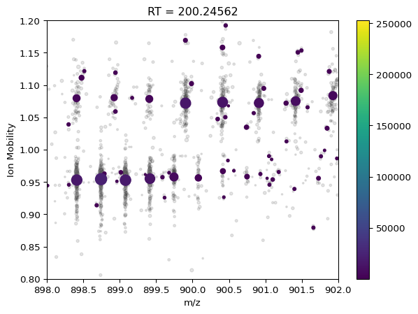

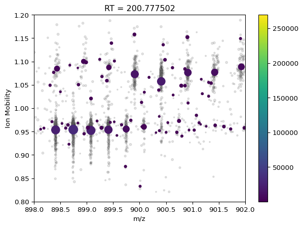

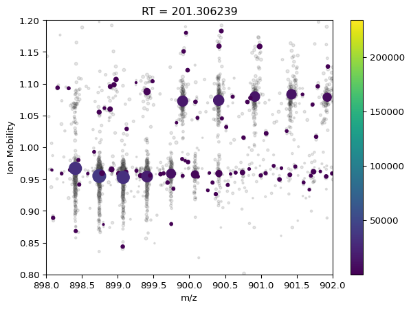

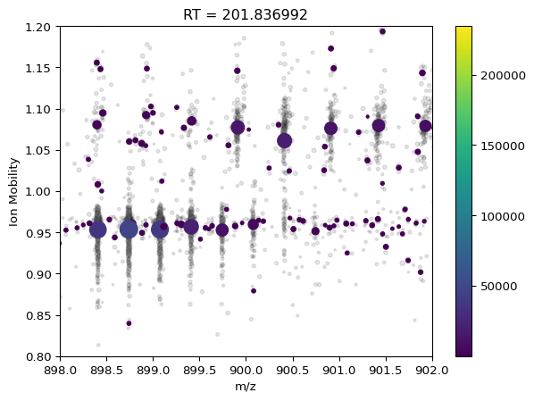

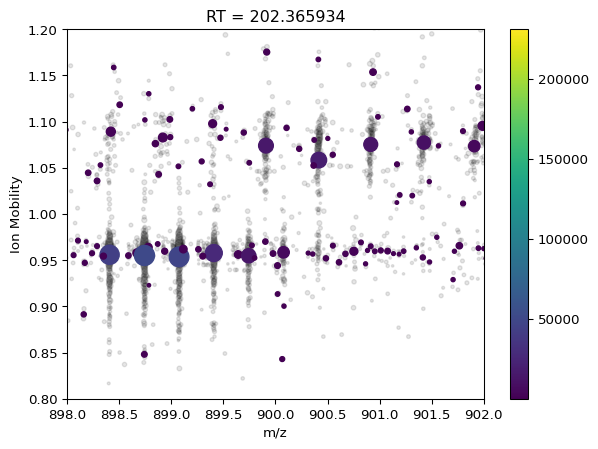

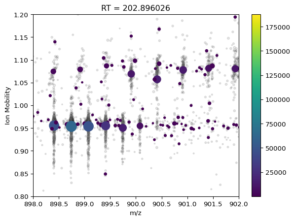


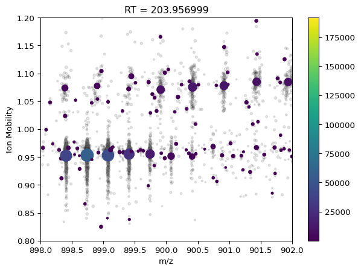

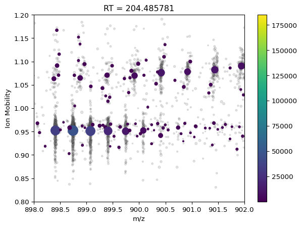

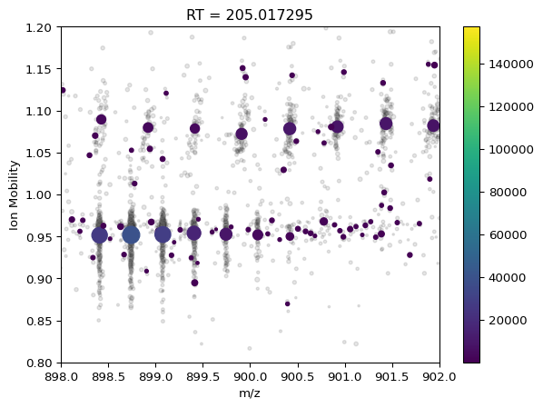

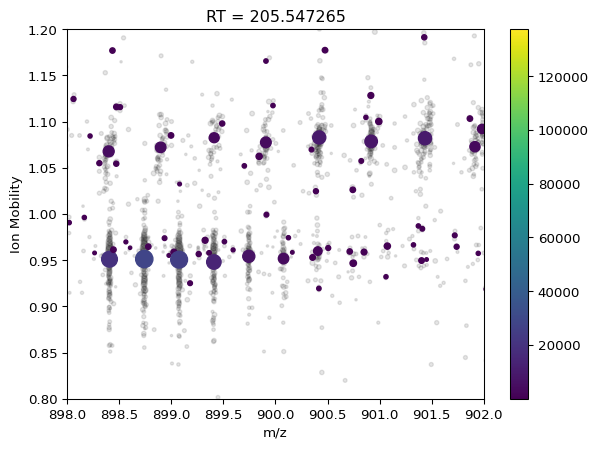


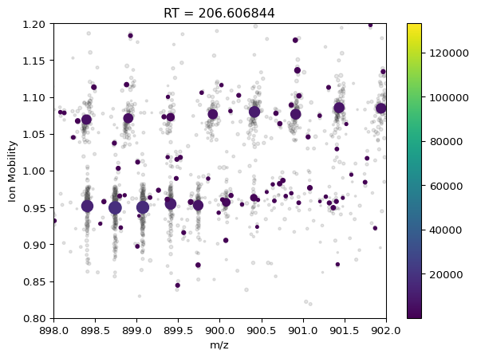


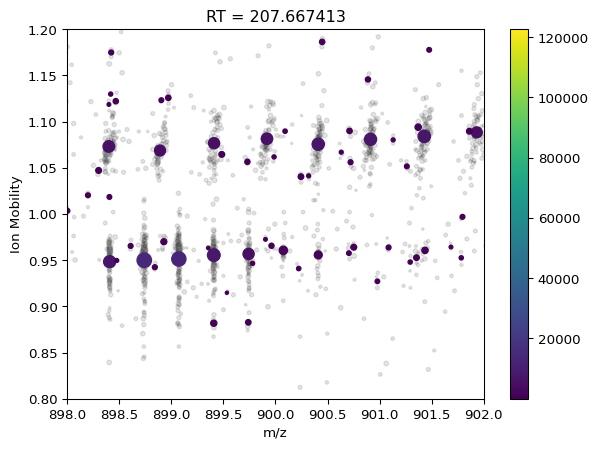

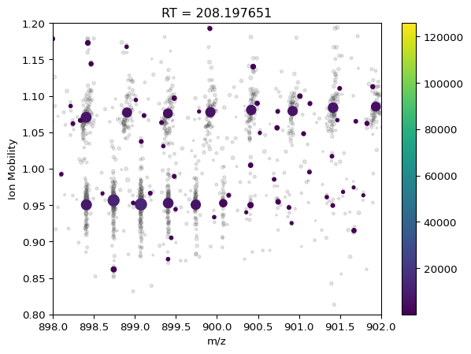

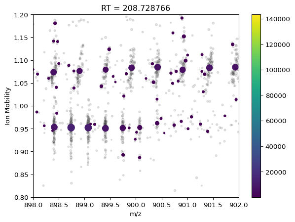

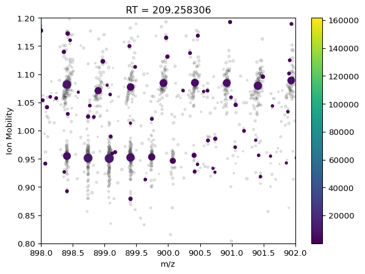

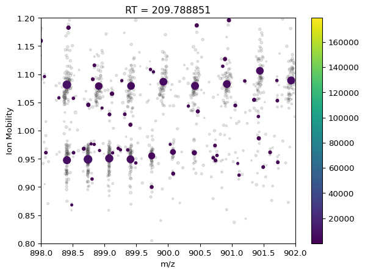
