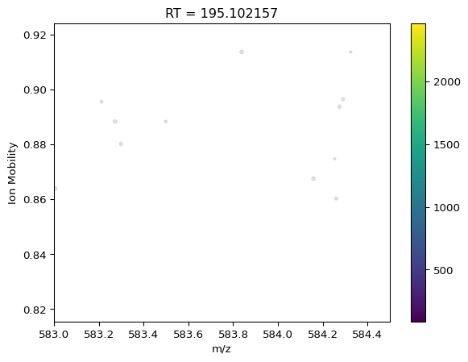
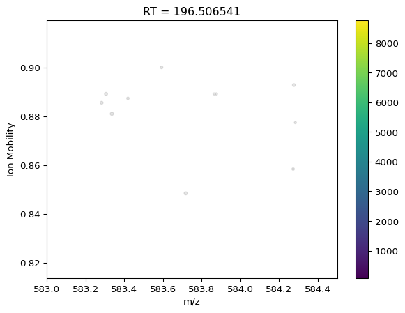
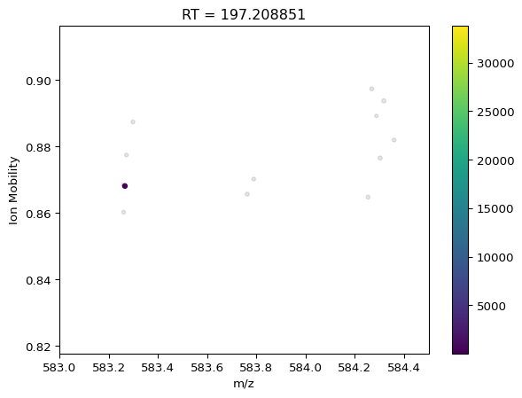
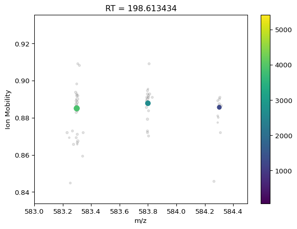
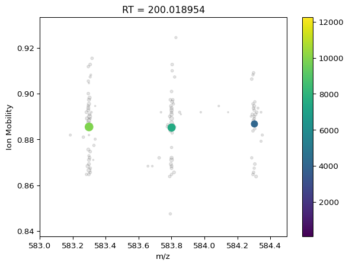
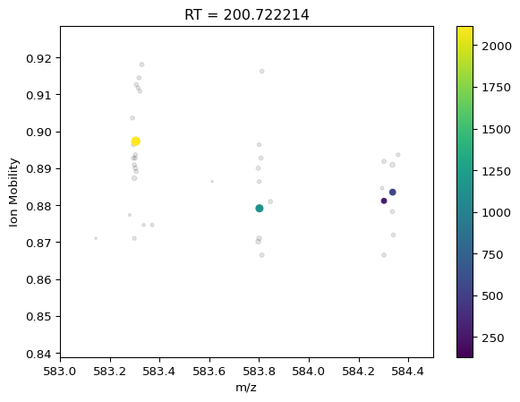
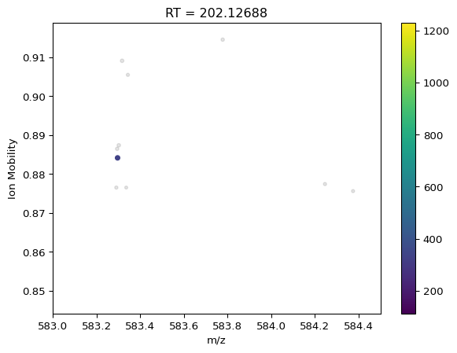
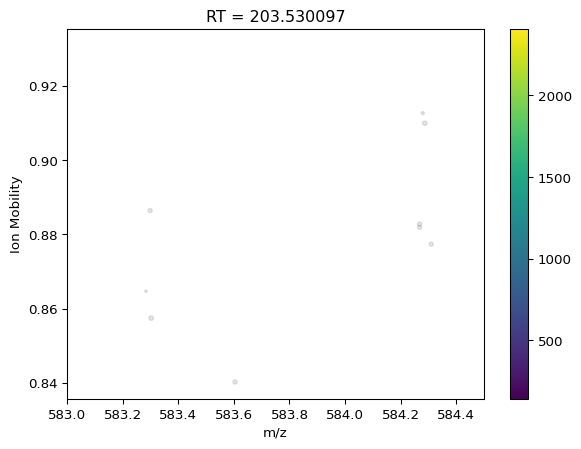
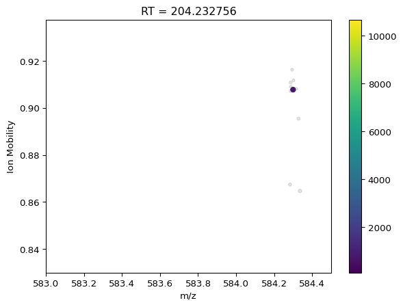
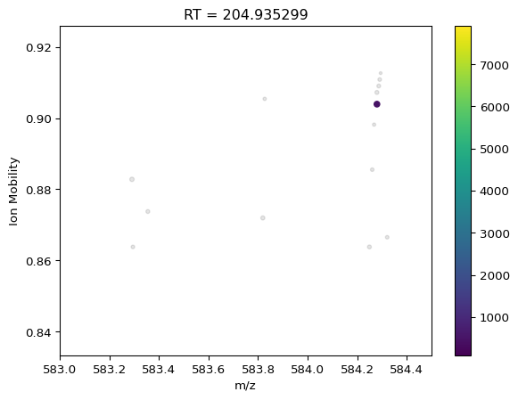

Visualizing centroiding
================

``` python
from msflattener.bruker import centroid_ims, get_timstof_data
import matplotlib.pyplot as plt
import polars as pl
import numpy as np

out = get_timstof_data("data/20221016_PRO1_LSVD_00_30-0051_100ng_Regular_P1-C6_1_11234.hdf", progbar=False, safe=False)
print(out)

centroided_out = centroid_ims(out, min_neighbors=2, mz_distance=0.02, ims_distance=0.02, progbar=False)
print(centroided_out)
```

    /Users/sebastianpaez/git/msflattener/venv/lib/python3.11/site-packages/tqdm/auto.py:21: TqdmWarning: IProgress not found. Please update jupyter and ipywidgets. See https://ipywidgets.readthedocs.io/en/stable/user_install.html
      from .autonotebook import tqdm as notebook_tqdm
    WARNING:root:WARNING: Temp mmap arrays are written to /var/folders/5j/x2qvf77j1m7736lccs2xt6c40000gn/T/temp_mmap_77n2skr1. Cleanup of this folder is OS dependant, and might need to be triggered manually! Current space: 68,146,782,208

    WARNING:root:WARNING: No Bruker libraries are available for this operating system. Mobility and m/z values need to be estimated. While this estimation often returns acceptable results with errors < 0.02 Th, huge errors (e.g. offsets of 6 Th) have already been observed for some samples!

    shape: (845_699, 6)
    ┌─────────────────┬────────────────┬────────────┬────────────────┬────────────────┬────────────────┐
    │ mz_values       ┆ corrected_inte ┆ rt_values  ┆ mobility_value ┆ quad_low_mz_va ┆ quad_high_mz_v │
    │ ---             ┆ nsity_values   ┆ ---        ┆ s              ┆ lues           ┆ alues          │
    │ list[f64]       ┆ ---            ┆ f64        ┆ ---            ┆ ---            ┆ ---            │
    │                 ┆ list[u32]      ┆            ┆ f64            ┆ f64            ┆ f64            │
    ╞═════════════════╪════════════════╪════════════╪════════════════╪════════════════╪════════════════╡
    │ [104.761411,    ┆ [11, 131, …    ┆ 0.554721   ┆ 1.270136       ┆ -1.0           ┆ -1.0           │
    │ 105.967458, …   ┆ 69]            ┆            ┆                ┆                ┆                │
    │ 1224.…          ┆                ┆            ┆                ┆                ┆                │
    │ [109.164539,    ┆ [81, 172, …    ┆ 0.554721   ┆ 1.269231       ┆ -1.0           ┆ -1.0           │
    │ 109.502719, …   ┆ 42]            ┆            ┆                ┆                ┆                │
    │ 1620.…          ┆                ┆            ┆                ┆                ┆                │
    │ [105.198447,    ┆ [155, 25, …    ┆ 0.554721   ┆ 1.268326       ┆ -1.0           ┆ -1.0           │
    │ 109.757925, …   ┆ 33]            ┆            ┆                ┆                ┆                │
    │ 1460.…          ┆                ┆            ┆                ┆                ┆                │
    │ [107.543046,    ┆ [35, 95, … 78] ┆ 0.554721   ┆ 1.266516       ┆ -1.0           ┆ -1.0           │
    │ 110.453063, …   ┆                ┆            ┆                ┆                ┆                │
    │ 1651.…          ┆                ┆            ┆                ┆                ┆                │
    │ …               ┆ …              ┆ …          ┆ …              ┆ …              ┆ …              │
    │ [279.081161,    ┆ [106, 89, …    ┆ 467.832057 ┆ 0.756109       ┆ -1.0           ┆ -1.0           │
    │ 326.997929, …   ┆ 155]           ┆            ┆                ┆                ┆                │
    │ 669.6…          ┆                ┆            ┆                ┆                ┆                │
    │ [202.040997,    ┆ [191, 96, …    ┆ 467.832057 ┆ 0.753394       ┆ -1.0           ┆ -1.0           │
    │ 279.081161, …   ┆ 34]            ┆            ┆                ┆                ┆                │
    │ 946.6…          ┆                ┆            ┆                ┆                ┆                │
    │ [287.869812,    ┆ [71, 109, …    ┆ 467.832057 ┆ 0.750679       ┆ -1.0           ┆ -1.0           │
    │ 290.84918, …    ┆ 77]            ┆            ┆                ┆                ┆                │
    │ 1042.5…         ┆                ┆            ┆                ┆                ┆                │
    │ [314.895187,    ┆ [88, 165, …    ┆ 467.832057 ┆ 0.747059       ┆ -1.0           ┆ -1.0           │
    │ 350.801528, …   ┆ 83]            ┆            ┆                ┆                ┆                │
    │ 1500.…          ┆                ┆            ┆                ┆                ┆                │
    └─────────────────┴────────────────┴────────────┴────────────────┴────────────────┴────────────────┘

    2023-05-05 00:45:14.379 | INFO     | msflattener.bruker:centroid_ims:172 - Finished simple ims merge, skipped 3807 spectra for not having any peaks

    shape: (9_508, 6)
    ┌─────────────────┬────────────────┬────────────────┬────────────────┬────────────────┬────────────┐
    │ mz_values       ┆ corrected_inte ┆ mobility_value ┆ quad_low_mz_va ┆ quad_high_mz_v ┆ rt_values  │
    │ ---             ┆ nsity_values   ┆ s              ┆ lues           ┆ alues          ┆ ---        │
    │ list[f64]       ┆ ---            ┆ ---            ┆ ---            ┆ ---            ┆ f64        │
    │                 ┆ list[u64]      ┆ list[f64]      ┆ f64            ┆ f64            ┆            │
    ╞═════════════════╪════════════════╪════════════════╪════════════════╪════════════════╪════════════╡
    │ [352.226314,    ┆ [16636, 117, … ┆ [0.905854,     ┆ -1.0           ┆ -1.0           ┆ 0.554721   │
    │ 738.813487, …   ┆ 169]           ┆ 1.031879, …    ┆                ┆                ┆            │
    │ 368.9…          ┆                ┆ 0.813219]      ┆                ┆                ┆            │
    │ [1062.557595,   ┆ [199, 1602, …  ┆ [1.166959,     ┆ -1.0           ┆ -1.0           ┆ 1.256356   │
    │ 413.252239, …   ┆ 199]           ┆ 1.01431, …     ┆                ┆                ┆            │
    │ 972.…           ┆                ┆ 0.906458]      ┆                ┆                ┆            │
    │ [550.208243,    ┆ [2003, 148, …  ┆ [1.063915,     ┆ -1.0           ┆ -1.0           ┆ 1.95912    │
    │ 1206.490745, …  ┆ 210]           ┆ 0.948459, …    ┆                ┆                ┆            │
    │ 1041…           ┆                ┆ 0.925663]      ┆                ┆                ┆            │
    │ [1026.602979,   ┆ [286, 532, …   ┆ [1.162943,     ┆ -1.0           ┆ -1.0           ┆ 2.661204   │
    │ 1129.578807, …  ┆ 248]           ┆ 0.962646, …    ┆                ┆                ┆            │
    │ 116…            ┆                ┆ 0.959243]      ┆                ┆                ┆            │
    │ …               ┆ …              ┆ …              ┆ …              ┆ …              ┆ …          │
    │ [128.15265,     ┆ [206, 104, …   ┆ [1.075311,     ┆ -1.0           ┆ -1.0           ┆ 465.71622  │
    │ 272.795315, …   ┆ 221]           ┆ 1.10724, …     ┆                ┆                ┆            │
    │ 1352.5…         ┆                ┆ 1.056561]      ┆                ┆                ┆            │
    │ [393.287747,    ┆ [3681, 262, …  ┆ [1.014427,     ┆ -1.0           ┆ -1.0           ┆ 466.419937 │
    │ 1326.004135, …  ┆ 309]           ┆ 1.033674, …    ┆                ┆                ┆            │
    │ 1536…           ┆                ┆ 0.938448]      ┆                ┆                ┆            │
    │ [842.752414,    ┆ [211, 405, …   ┆ [1.113249,     ┆ -1.0           ┆ -1.0           ┆ 467.120844 │
    │ 907.586916, …   ┆ 231]           ┆ 0.863052, …    ┆                ┆                ┆            │
    │ 1133.…          ┆                ┆ 0.970882]      ┆                ┆                ┆            │
    │ [759.208911,    ┆ [7066, 313, …  ┆ [1.19694,      ┆ -1.0           ┆ -1.0           ┆ 467.832057 │
    │ 995.641645, …   ┆ 158]           ┆ 1.189798, …    ┆                ┆                ┆            │
    │ 674.7…          ┆                ┆ 0.975972]      ┆                ┆                ┆            │
    └─────────────────┴────────────────┴────────────────┴────────────────┴────────────────┴────────────┘

``` python
promise = pl.col("rt_values").is_between(195, 205) & pl.col("quad_low_mz_values").is_between(576, 577)
collapsed = centroided_out.filter(promise)
orig = out.filter(promise)

print(orig)
print(collapsed)
```

    shape: (1_101, 6)
    ┌─────────────────┬────────────────┬────────────┬────────────────┬────────────────┬────────────────┐
    │ mz_values       ┆ corrected_inte ┆ rt_values  ┆ mobility_value ┆ quad_low_mz_va ┆ quad_high_mz_v │
    │ ---             ┆ nsity_values   ┆ ---        ┆ s              ┆ lues           ┆ alues          │
    │ list[f64]       ┆ ---            ┆ f64        ┆ ---            ┆ ---            ┆ ---            │
    │                 ┆ list[u32]      ┆            ┆ f64            ┆ f64            ┆ f64            │
    ╞═════════════════╪════════════════╪════════════╪════════════════╪════════════════╪════════════════╡
    │ [228.123603,    ┆ [143, 48, …    ┆ 195.102157 ┆ 0.919005       ┆ 576.315512     ┆ 601.315512     │
    │ 228.142482, …   ┆ 105]           ┆            ┆                ┆                ┆                │
    │ 769.3…          ┆                ┆            ┆                ┆                ┆                │
    │ [282.857695,    ┆ [67, 55, … 50] ┆ 195.102157 ┆ 0.913575       ┆ 576.315512     ┆ 601.315512     │
    │ 361.867247, …   ┆                ┆            ┆                ┆                ┆                │
    │ 938.5…          ┆                ┆            ┆                ┆                ┆                │
    │ [467.1525,      ┆ [180, 24, …    ┆ 195.102157 ┆ 0.911765       ┆ 576.315512     ┆ 601.315512     │
    │ 488.155299, …   ┆ 31]            ┆            ┆                ┆                ┆                │
    │ 994.515…        ┆                ┆            ┆                ┆                ┆                │
    │ [330.172825,    ┆ [129, 94, …    ┆ 195.102157 ┆ 0.91086        ┆ 576.315512     ┆ 601.315512     │
    │ 471.278125, …   ┆ 71]            ┆            ┆                ┆                ┆                │
    │ 994.4…          ┆                ┆            ┆                ┆                ┆                │
    │ …               ┆ …              ┆ …          ┆ …              ┆ …              ┆ …              │
    │ [447.751398,    ┆ [134, 95, …    ┆ 204.935299 ┆ 0.849321       ┆ 576.315512     ┆ 601.315512     │
    │ 477.137029, …   ┆ 61]            ┆            ┆                ┆                ┆                │
    │ 1001.…          ┆                ┆            ┆                ┆                ┆                │
    │ [296.186694,    ┆ [102, 151, …   ┆ 204.935299 ┆ 0.844796       ┆ 576.315512     ┆ 601.315512     │
    │ 309.149131, …   ┆ 83]            ┆            ┆                ┆                ┆                │
    │ 1073.…          ┆                ┆            ┆                ┆                ┆                │
    │ [281.112936,    ┆ [92, 141, …    ┆ 204.935299 ┆ 0.842081       ┆ 576.315512     ┆ 601.315512     │
    │ 455.701244, …   ┆ 100]           ┆            ┆                ┆                ┆                │
    │ 918.4…          ┆                ┆            ┆                ┆                ┆                │
    │ [420.208757,    ┆ [99, 86, … 21] ┆ 204.935299 ┆ 0.837557       ┆ 576.315512     ┆ 601.315512     │
    │ 448.194529, …   ┆                ┆            ┆                ┆                ┆                │
    │ 1175.…          ┆                ┆            ┆                ┆                ┆                │
    └─────────────────┴────────────────┴────────────┴────────────────┴────────────────┴────────────────┘
    shape: (15, 6)
    ┌─────────────────┬────────────────┬────────────────┬────────────────┬────────────────┬────────────┐
    │ mz_values       ┆ corrected_inte ┆ mobility_value ┆ quad_low_mz_va ┆ quad_high_mz_v ┆ rt_values  │
    │ ---             ┆ nsity_values   ┆ s              ┆ lues           ┆ alues          ┆ ---        │
    │ list[f64]       ┆ ---            ┆ ---            ┆ ---            ┆ ---            ┆ f64        │
    │                 ┆ list[u64]      ┆ list[f64]      ┆ f64            ┆ f64            ┆            │
    ╞═════════════════╪════════════════╪════════════════╪════════════════╪════════════════╪════════════╡
    │ [871.528737,    ┆ [852, 1923, …  ┆ [0.897727,     ┆ 576.315512     ┆ 601.315512     ┆ 195.102157 │
    │ 757.443434, …   ┆ 1305]          ┆ 0.896087, …    ┆                ┆                ┆            │
    │ 593.7…          ┆                ┆ 0.907799]      ┆                ┆                ┆            │
    │ [355.195373,    ┆ [433, 842, …   ┆ [0.830513,     ┆ 576.315512     ┆ 601.315512     ┆ 195.804076 │
    │ 870.526366, …   ┆ 182]           ┆ 0.89483, …     ┆                ┆                ┆            │
    │ 847.4…          ┆                ┆ 0.829531]      ┆                ┆                ┆            │
    │ [807.399699,    ┆ [1512, 4887, … ┆ [0.829164,     ┆ 576.315512     ┆ 601.315512     ┆ 196.506541 │
    │ 832.439564, …   ┆ 233]           ┆ 0.881947, …    ┆                ┆                ┆            │
    │ 530.2…          ┆                ┆ 0.894054]      ┆                ┆                ┆            │
    │ [780.335645,    ┆ [1312, 562, …  ┆ [0.826724,     ┆ 576.315512     ┆ 601.315512     ┆ 197.208851 │
    │ 580.320941, …   ┆ 241]           ┆ 0.90044, …     ┆                ┆                ┆            │
    │ 419.1…          ┆                ┆ 0.881792]      ┆                ┆                ┆            │
    │ …               ┆ …              ┆ …              ┆ …              ┆ …              ┆ …          │
    │ [1067.651124,   ┆ [252, 469, …   ┆ [0.902769,     ┆ 576.315512     ┆ 601.315512     ┆ 202.828576 │
    │ 330.156911, …   ┆ 579]           ┆ 0.895166, …    ┆                ┆                ┆            │
    │ 534.…           ┆                ┆ 0.89696]       ┆                ┆                ┆            │
    │ [801.49259,     ┆ [197, 490, …   ┆ [0.902058,     ┆ 576.315512     ┆ 601.315512     ┆ 203.530097 │
    │ 935.47417, …    ┆ 174]           ┆ 0.889039, …    ┆                ┆                ┆            │
    │ 586.363…        ┆                ┆ 0.878353]      ┆                ┆                ┆            │
    │ [881.501732,    ┆ [870, 298, …   ┆ [0.871094,     ┆ 576.315512     ┆ 601.315512     ┆ 204.232756 │
    │ 799.518275, …   ┆ 155]           ┆ 0.85944, …     ┆                ┆                ┆            │
    │ 582.7…          ┆                ┆ 0.88858]       ┆                ┆                ┆            │
    │ [315.154871,    ┆ [1166, 511, …  ┆ [0.912141,     ┆ 576.315512     ┆ 601.315512     ┆ 204.935299 │
    │ 881.442183, …   ┆ 96]            ┆ 0.893821, …    ┆                ┆                ┆            │
    │ 571.2…          ┆                ┆ 0.875584]      ┆                ┆                ┆            │
    └─────────────────┴────────────────┴────────────────┴────────────────┴────────────────┴────────────┘

``` python
for x in collapsed["rt_values"]:
    tmp_orig = orig.filter(pl.col("rt_values").is_between(x - 0.001, x + 0.001))
    tmp_collapsed = collapsed.filter(pl.col("rt_values").is_between(x - 0.001, x + 0.001))

    plt.scatter(
        np.concatenate(tmp_orig["mz_values"]),
        np.concatenate([[x]*len(y) for y, x in zip(tmp_orig["mz_values"], tmp_orig["mobility_values"])]),
        s = np.sqrt(np.concatenate(tmp_orig["corrected_intensity_values"])),
        alpha = 0.1,
        c = "black",
    )
    plt.scatter(
        np.concatenate(tmp_collapsed["mz_values"]),
        np.concatenate(tmp_collapsed["mobility_values"]),
        c = np.concatenate(tmp_collapsed["corrected_intensity_values"]),
        s = np.sqrt(np.concatenate(tmp_collapsed["corrected_intensity_values"])),
    )
    plt.xlim(583, 584.5)
    plt.xlabel("m/z")
    plt.ylabel("Ion Mobility")
    plt.title(f"RT = {x}")
    plt.colorbar()
    plt.show()
```

























